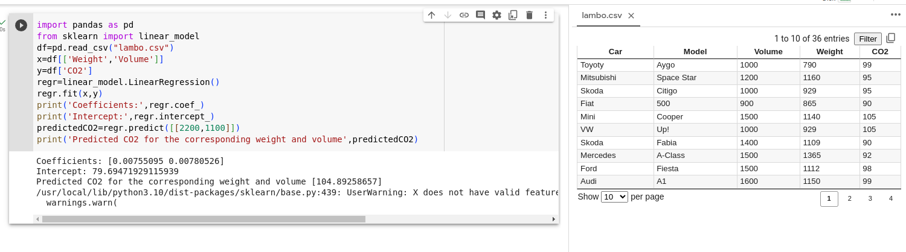

# Implementation of Multivariate Linear Regression
## Aim
To write a python program to implement multivariate linear regression and predict the output.
## Equipment’s required:
1.	Hardware – PCs
2.	Anaconda – Python 3.7 Installation / Moodle-Code Runner
## Algorithm:
### Step1
Importing pandas and scikit-learn libraries.

### Step2
Reading the data from a CSV file

### Step3
Splitting the data into features (X) and target (y)


### Step4
Creating and fitting the linear regression model

### Step5
Printing the coefficients and intercept of the linear regression model

### Step6
Making a prediction

### Step7
Printing the predicted CO2 emissions

## Program:
```python
#Developed By:Sree Hari.K
#Register number:23000908
import pandas as pd
from sklearn import linear_model
df=pd.read_csv("lambo.csv")
x=df[['Weight','Volume']]
y=df['CO2']
regr=linear_model.LinearRegression()
regr.fit(x,y)
print('Coefficients:',regr.coef_)
print('Intercept:',regr.intercept_)
predictedCO2=regr.predict([[2200,1100]])
print('Predicted CO2 for the corresponding weight and volume',predictedCO2)


```
## Output:



## Result
Thus the multivariate linear regression is implemented and predicted the output using python program.